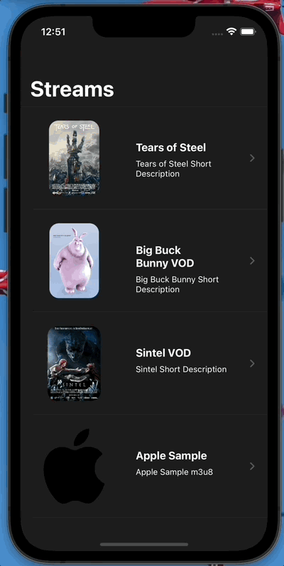

# streamy-app-swiftui

This app is build with Swift using SwiftUI and Composable Architecture.

The purpose of the app is to display the list of the possible streams received in the API call. 
Tapping on the list item displays detail page where user can see a streamed video, its description.
Tap on the video frame pauses/resumes the video playback

In order to run the app open streamy-app.xcodeproj, select streamy-app scheme and hit CMD+R

#Screenshots

